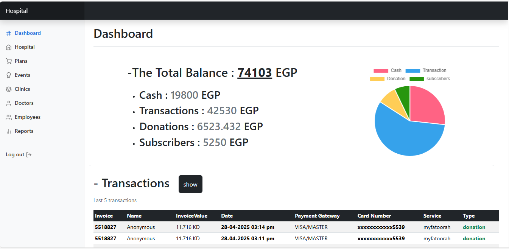
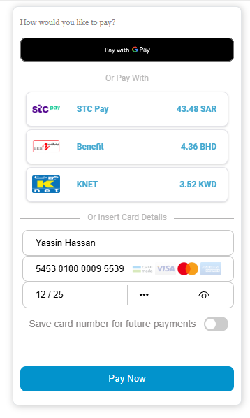
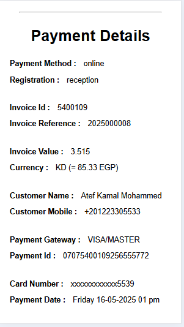
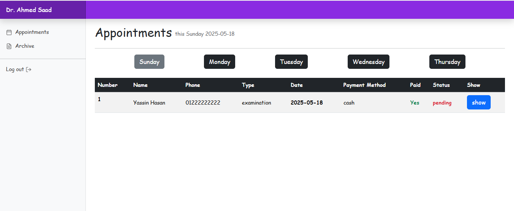
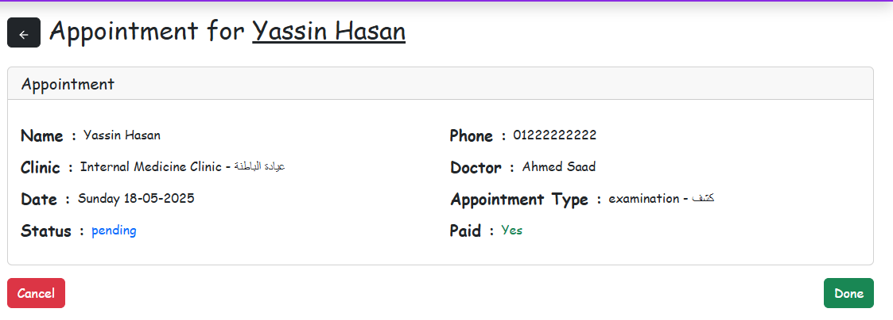

# Hospital Appointment System (Laravel)

- This is a full-featured Laravel web application for managing hospital appointments. Patients can easily register, book appointments with doctors, and pay securely online using the MyFatoorah payment gateway.
_______________________

### Features
* Admin dashboard to manage users and appointments
* Patient registration
* Appointment scheduling
* Doctor management
* Payment integration via MyFatoorah
* Doctor management
* Data Analysis
* Donations
* Call-Center (live Chat)

_______________________

### Built With
* <b>Backent :</b> Laravel 10
* <b>Frontend :</b> HTML, CSS, Bootstrap 5, JavaScript , JQuery
* <b>Database :</b> MySQL
* <b>Real-Time :</b> Pusher
* <b>Payment :</b> MyFatoorah API

_______________________

### ScreenShots

- Admin dashboard

________________

- MyFatoorah Payment

________________

- Invoice

________________

- Doctor Panel

________________

## Installation

- 1- Colne this repository
- 1- composer install
- 1- npm install && npm run dev
- 1- php artisan key:generate
- 1- php artisan migrate 
- 1- php artisan serve
get myfatoorah api key and pusher key and put them in the .env file

_______________

## Contributions
Contributions, issues, and feature requests are welcome! Feel free to open an issue.
